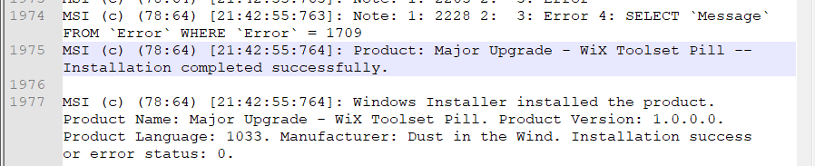
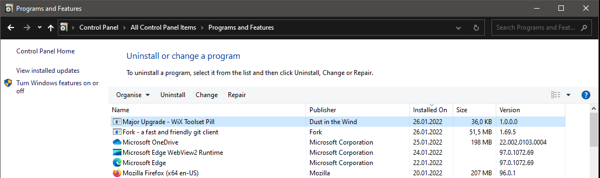
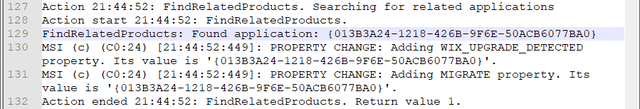
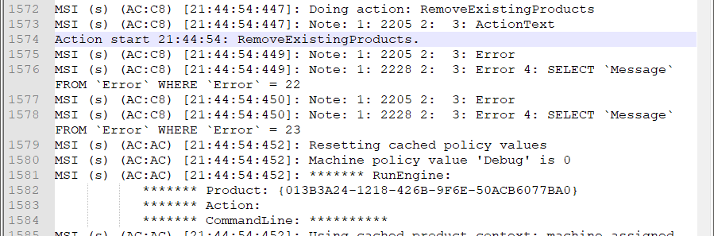
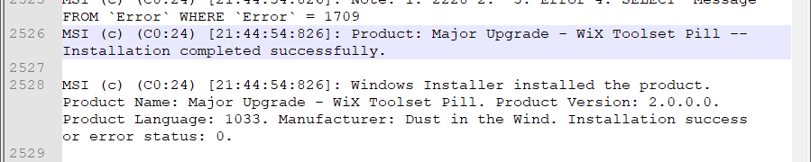
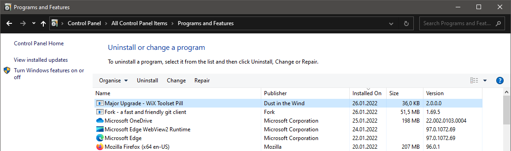
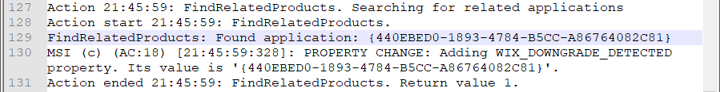
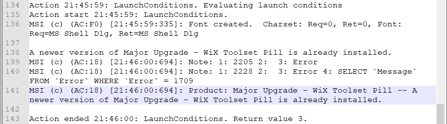
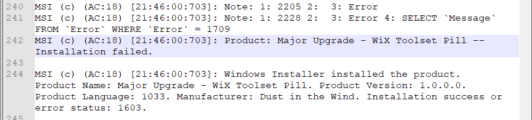
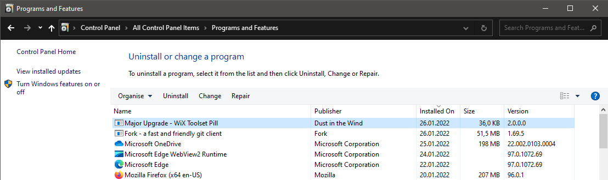

# Major Upgrade

## Description

After the first release of our product, most likely, will be other reincarnations that will need to be deployed. How should we prepare our first installer and how to create our next version of the installer to handle the upgrade process?

## Implementation

Actually, the WiX project template already includes the upgrade support.
Let's see how it works.

### Step 0: Create a simple installer

Create a simple WiX installer that deploys a single file.

See the "My First Installer" pill for an example:

- [My First Installer](https://github.com/WiX-Toolset-Pills-15mg/My-First-Installer)

### Step 1: The `Product` and its `Id`

In the context of Windows Installer, a product is a version of our application. Whenever we release a new version of the application, for Windows Installer, that is a new product.

The `Id` attribute uniquely identifies a product and, for each version we must generate a new id, that's why we use the `"*"` to let WiX generate a new id at build time.

```xml
<Product
    Id="*"
    ...>
```

### Step 2: The `Version`

The `Version` attribute contains the version number. Each time a new version of our application is released, we must also increment the version number of the installer.

**Note**: The first three values are important.

```xml
<Product
    Id="*"
    Version="1.0.0.0"
    ...>
```

### Step 3: The `UpgradeCode`

The `UpgradeCode` uniquely identifies our application and Windows Installer will use it to determine if other versions are already present in the system.

Therefore, the `UpgradeCode` must remain the same for all versions of the product. It will never be changed.

```xml
<Product
    Id="*"
    Version="1.0.0.0"
    UpgradeCode="6da0fe4e-4c88-4e10-a39e-dd7a4346de53"
    ...>
```

### Step 4: The `<MajorUpgrade>` tag

Just by adding the  `<MajorUpgrade>` tag, the installer gains the upgrade support. When installing a new version of the product, the installer will detect that an older version is already installed in the system (based on the `UpgradeCode`) and will uninstall it before installing the new version.

```xml
<MajorUpgrade />
```

**Note**: Without this tag, if we attempt an upgrade, the new version will be installed allongside the old version.

### Step 5: The `DowngradeErrorMessage`

By adding the `DowngradeErrorMessage` attribute, we prevent installing an older version if a newer version is already installer in the system.

Remove this attribute if downgrade is allowed.

```xml
<MajorUpgrade DowngradeErrorMessage="A newer version of [ProductName] is already installed." />
```

### Step 6: Build two different versions

#### Build version 1.0.0.0

Set the version to 1.0.0.0 and build.

```xml
<Product
    Id="*"
    Name="Major Upgrade - WiX Toolset Pill"
    Language="1033"
    Version="1.0.0.0"
    Manufacturer="Dust in the Wind"
    UpgradeCode="6da0fe4e-4c88-4e10-a39e-dd7a4346de53">
```

The Product's Id will be generated at build time by WiX Toolset.

Copy the results from the `bin\Release` directory into a new directory. For example Major Upgrade v1.0.0.0`.

#### Build version 2.0.0.0

Set the version to 1.0.0.0 and build.

```xml
<Product
    Id="*"
    Name="Major Upgrade - WiX Toolset Pill"
    Language="1033"
    Version="2.0.0.0"
    Manufacturer="Dust in the Wind"
    UpgradeCode="6da0fe4e-4c88-4e10-a39e-dd7a4346de53">
```

The Product's Id will be generated at build time by WiX Toolset.

Copy the results from the `bin\Release` directory into a new directory. For example `Major Upgrade v2.0.0.0`.

### Step 7: Install version 1.0.0.0

Run the `install.bat` script from the `Major Upgrade v1.0.0.0` directory to install version 1.0.0.0.

In the log file we can see that the installation was successful:



Look into Control Panel -> Programs and Features to validate that version 1.0.0.0 is installed.



### Step 8 - Upgrade to version 2.0.0.0

Run the `install.bat` script from the `Major Upgrade v2.0.0.0` directory to upgrade to version 2.0.0.0.

In the log file we can see that `FindRelatedProducts` custom action has found another version of the application already installed in the system (our previously installed version 1.0.0.0) and it sets the `WIX_UPGRADE_DETECTED` and the `MIGRATE` properties with the product id of that version:



In the server execution we find the `RemoveExistingProducts` custom action that performs un uninstall of the older version:



And, in the end, the installation (upgrade) is successful:



Look into Control Panel -> Programs and Features to validate that version 2.0.0.0 is installed.



### Step 9 - Downgrade to version 1.0.0.0

Run the `install.bat` script again from the Major Upgrade v1.0.0.0` directory to attempt a downgrade back to version 1.0.0.0. It will fail.

Just like in the upgrade situation, the `FindRelatedProducts` custom action finds the installed product (our 2.0.0.0 version) and sets only the `WIX_DOWNGRADE_DETECTED` property this time:



Immediatelly after that, the `LaunchConditions` custom action is checking if this is a downgrade and stops the installation:



The installation is unsuccessful:



Look into Control Panel -> Programs and Features to validate that version 2.0.0.0 is still installed.


